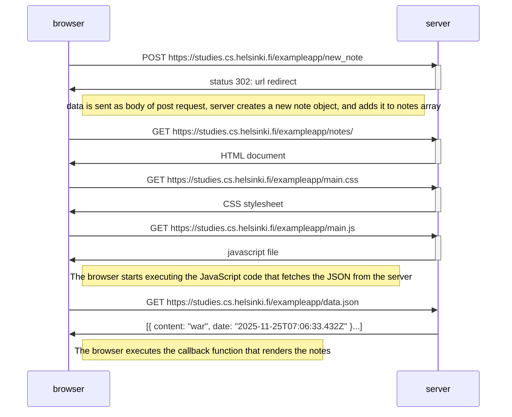

```mermaid
sequenceDiagram
    participant browser
    participant server

    browser ->> server: POST https://studies.cs.helsinki.fi/exampleapp/new_note
    activate server
    server ->> browser: status 302: url redirect
    deactivate server
    Note right of browser: data is sent as body of post request, server creates a new note object, and adds it to notes array

    browser ->> server: GET https://studies.cs.helsinki.fi/exampleapp/notes/
    activate server
    server ->> browser: HTML document
    deactivate server

    browser ->> server: GET https://studies.cs.helsinki.fi/exampleapp/main.css
    activate server
    server ->> browser: CSS stylesheet
    deactivate server

    browser ->> server: GET https://studies.cs.helsinki.fi/exampleapp/main.js
    activate server
    server ->> browser: javascript file
    deactivate server

    Note right of browser: The browser starts executing the JavaScript code that fetches the JSON from the server

    browser ->> server: GET https://studies.cs.helsinki.fi/exampleapp/data.json
    server ->> browser: [{ content: "war", date: "2025-11-25T07:06:33.432Z" }...]
    
    Note right of browser: The browser executes the callback function that renders the notes
```