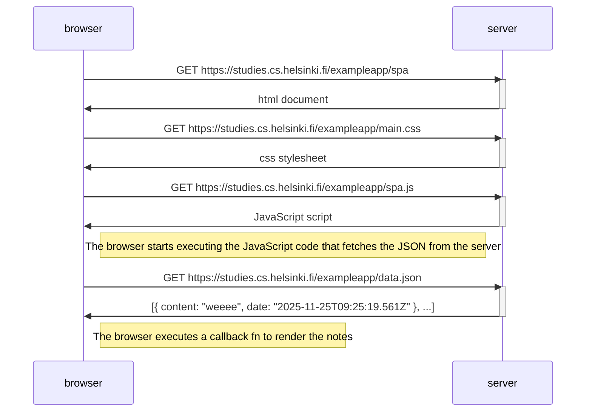

```mermaid
sequenceDiagram
    participant browser
    participant server

    browser ->> server: GET https://studies.cs.helsinki.fi/exampleapp/spa
    activate server
    server ->> browser: html document
    deactivate server

    browser ->> server: GET https://studies.cs.helsinki.fi/exampleapp/main.css
    activate server
    server ->> browser: css stylesheet
    deactivate server

    browser ->> server: GET https://studies.cs.helsinki.fi/exampleapp/spa.js
    activate server
    server ->> browser: JavaScript script
    deactivate server
    Note right of browser: The browser starts executing the JavaScript code that fetches the JSON from the server

    browser ->> server: GET https://studies.cs.helsinki.fi/exampleapp/data.json
    activate server
    server ->> browser: [{ content: "weeee", date: "2025-11-25T09:25:19.561Z" }, ...]
    deactivate server
    Note right of browser: The browser executes a callback fn to render the notes
```